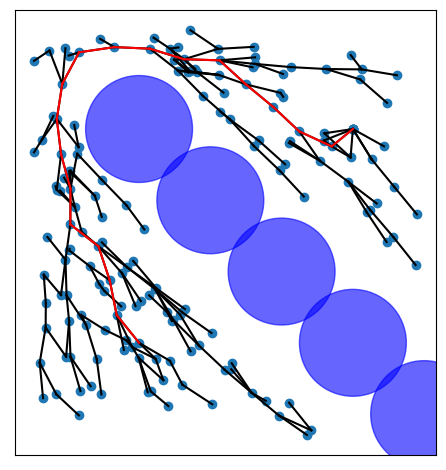

# RRT* Implementation in C++
Depends only on the standard C++ library.

Inspired by:
- https://gist.github.com/Fnjn/58e5eaa27a3dc004c3526ea82a92de80
- https://github.com/AtsushiSakai/PythonRobotics/blob/a2fc9f914ade3ecb6cda7e687acb39b3f8fc2e46/PathPlanning/RRTStar/rrt_star.py

## Documentation
TODO

## Example
Compile and run the example. This will generate a `data.json` file which holds information. This data can be parsed by the `plot.py` script inside the `scripts` folder. One example run is shown in the following image, where the blue circles represent obstacles:

